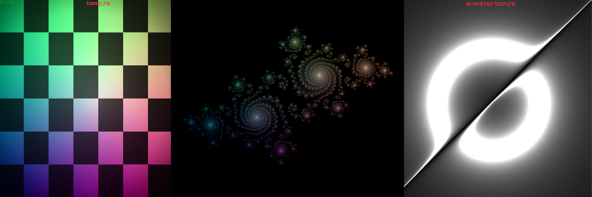

# Learning Shader Programming

Repo of the stuff I did when exploring writing Shaders using OpenGL/GLSL with C/Raylib. Uses [noob build system](https://github.com/nailuj05/noob)

You can find out more in this blog post: https://blog.julianlimburg.zip/Learning-Shader-Programming.html

--- 

## Basic

In here you can find some basic shaders I wrote to get started, learning the different functions and how to use them. 

## Masks

Here I experimented with some simple masking for images (like a GPU-accelerated graphics program) - became [TruMasker](https://github.com/nailuj05/tru-masker)

## Game of Life

Game of Life implemented using a shader operating on 2 swapped Buffers (not really optimized though)

## Raymarching

## Noise

White Noise, Perlin Noise, Voronoi Noise functions, fractal Brownian Motion and Domain Warping for some cool effects.

